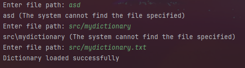
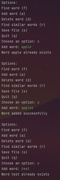
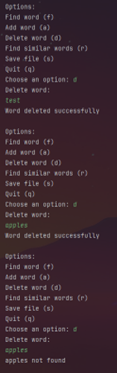
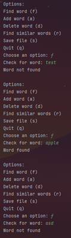
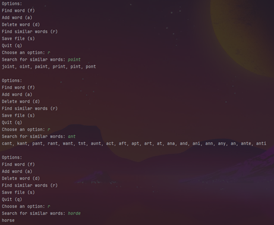
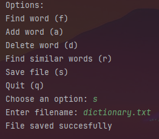

## 1. Introduction:
For this project, we had to design a dictionary that stores a large number of words and searches
through them efficiently to allow the user to not only find words in the dictionary, but also
similar words in the dictionary. Because of this, I decided that a low searching time complexity
is important. One way we could do this is by hashing, but that would be inefficient memory-
wise. Instead, I thought of sorting the words in an AVL Tree. However, with a time complexity
of O(log n) where n is the number of words in the dictionary, I evolved the idea to store the
corresponding letters of a word in the tree. As such, the program would only iterate through the
letters of the word across the tree to find the word. This would be far more efficient with a time
complexity of O(1) or O(m) where m is the length of the word to search for.

## 2. Pseudo-code:

Load File:\
To load from file, iterate over all of the words in the file, and for each word, call the addWord
method.

Add word:\
Start from the root. In the root, look through the node’s next array to find the first letter of the
word. Go to the first letter. Look through the node’s next array to find the second letter of the
word. Repeat this process for the length of the word. If a certain letter is not found in the next
array, instantiate it. If the word attribute of the final letter is true, throw
WordAlreadyExistsException, otherwise set it to true.

Delete word:\
Start from the root. In the root, look through the node’s next array to find the first letter of the
word. Go to the first letter. Look through the node’s next array to find the second letter of the
word. Repeat this process for the length of the word. If a certain letter is not found in the next
array, throw WordNotFoundException. If the word attribute of the final letter is false, throw
WordNotFoundException, otherwise set it to false.

Find word:\
Start from the root. In the root, look through the node’s next array to find the first letter of the
word. Go to the first letter. Look through the node’s next array to find the second letter of the
word. Repeat this process for the length of the word. If a certain letter is not found in the next
array, return false. Return the value of the word attribute for the final letter.

Find similar:\
We will iterate over all possible combinations to look for. Iterate (i) 2*(length of word) + 1
times. For each iteration, iterate (character) over the alphabets and an empty character ‘ ‘. If the
iteration is even and the character is not ‘ ‘, add the letter at index i / 2. Otherwise, if its odd and
the character is not ‘ ‘ replace the letter at index i / 2 with the letter. Otherwise, if its odd and the
character is ‘ ‘ delete the letter at index i / 2. Use findWord to check if the word is in the
dictionary and add it to the list of similar words. After all iterations, return the list of similar
words.

Save to file:\
Check if the file path provided exists, if it does not create it. For each node in the root’s next, if
the node is a word, print it to the file, otherwise recursively check each node in it’s next to see if
it’s a word to print, and check its children, and so on. When done return true.

## 3. Results:

Load File:\

Add Word:\

Delete Word:\

Find Word:\

Find Similar:\

Save to file:\

## 4. Challenges:

Some challenges occurred when trying to figure out which data structure to use. The common
solution was an AVL Tree, but on weaker devices and with a large data set. The time taken to
find words will vastly increase. After thorough thinking and many different iterations on possible
ideas, a solution was found. The rest was smooth as no issues emmerged.